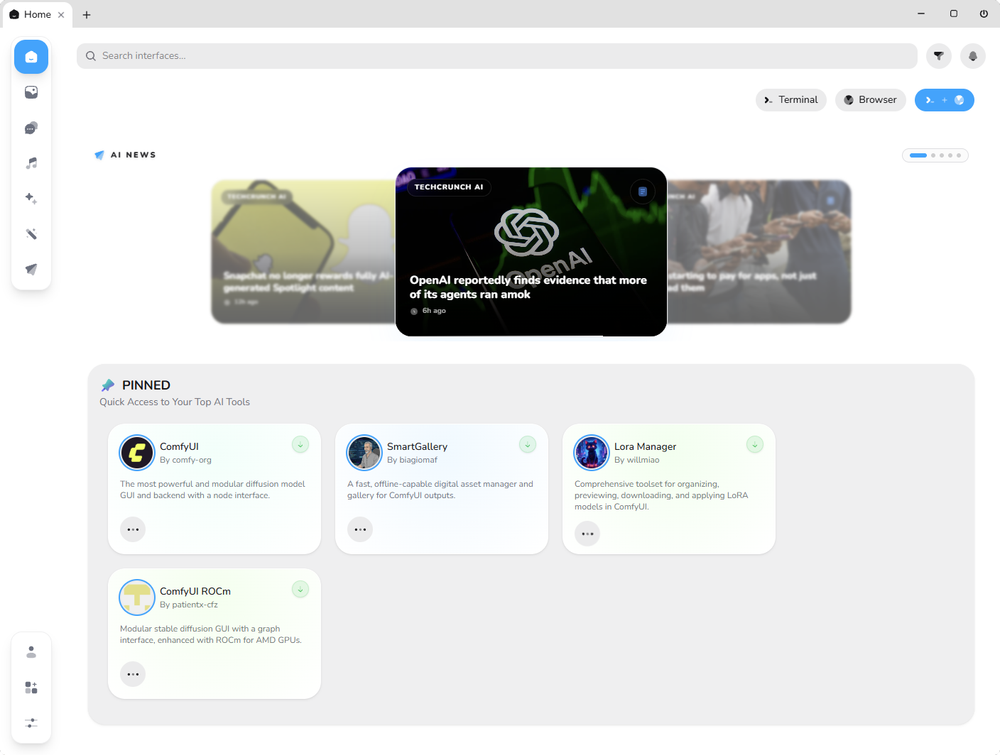
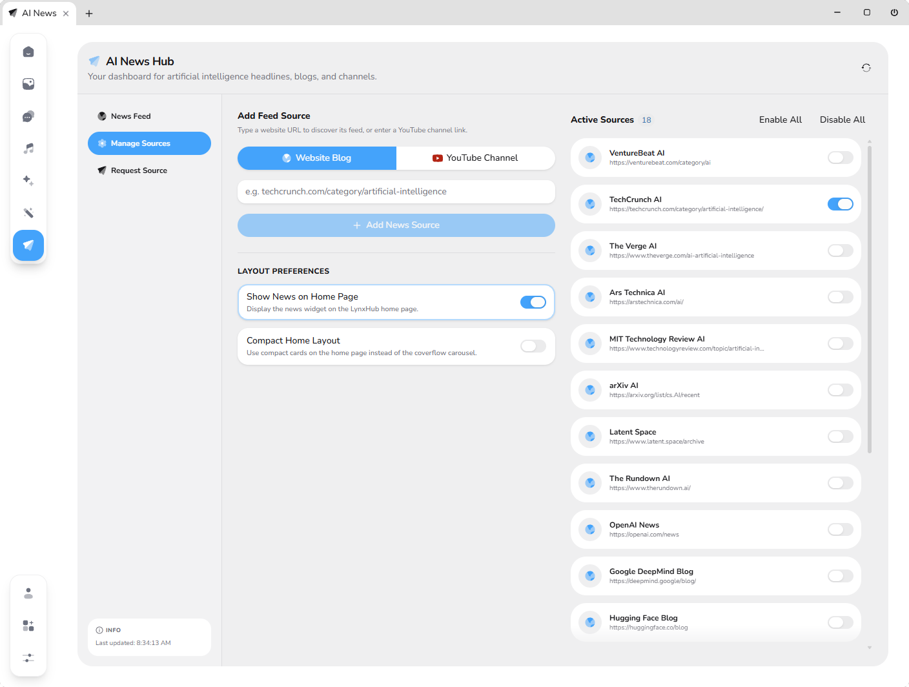

# AI News for LynxHub

Get all your AI news, YouTube videos, and research papers right inside LynxHub. No need to check ten different websites every day — see what's happening in AI all in one place.



## How to Install

1. Download LynxHub from [LynxHub.app/Download](https://lynxhub.app/download) and install it on your computer.
2. Open LynxHub, go to the **Plugins** page, and look for **AI News**.
3. Click **Install**, then restart LynxHub.

## Features

- **Top AI Sources**: Get updates from popular tech sites, arXiv papers, company blogs (OpenAI, Anthropic, Google, Meta), and YouTube channels.
- **Add Custom Feeds**: Add your own RSS feeds or ask for new ones to be added.
- **Dashboard Views**: Choose between a card grid or a compact list view on your LynxHub home screen.
- **Quick Search & Filters**: Search headlines or filter between website articles and YouTube videos.
- **Fast Loading**: Automatically saves updates in the background so everything loads fast.




## Local Development Setup

If you want to test or work on this extension locally:

1. Clone the main LynxHub host application:
   ```bash
   git clone https://github.com/TheLynxHub/LynxHub
   ```
2. Open the cloned folder and clone this repository into the `extension` folder:
   ```bash
   git clone https://github.com/TheLynxHub/AI-News extension && cd extension && npm i
   ```
3. Start LynxHub in development mode:
   ```bash
   cd .. && npm run dev
   ```
